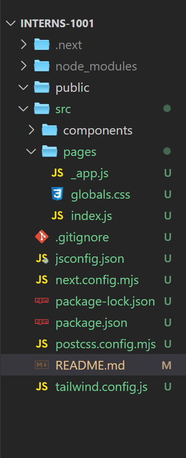
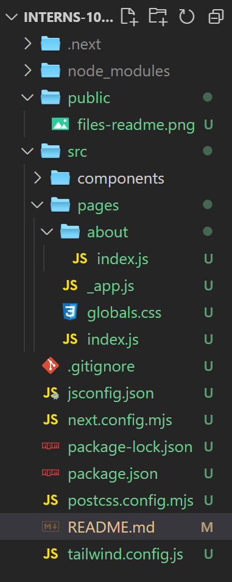

## To run the project on the browser type the following command in the terminal
```
npm i
```
then
```
npm run dev
```

## File Structure 



<p style="font-size: 18px">Let's talk about the folders inside <span style="color:green; font-weight:bold">src</span> folder.</p>
<ul style="font-size: 18px">
    <li>
        <span style="color:red; font-weight:bold">components</span>: 
        This folder is dedicated to housing all the reusable components that will be used throughout our project. Components are the building blocks of our application, allowing us to create modular, isolated pieces of UI that can be reused across different parts of our application.
        <ul>
            <li>Example: we might have components like <code>Header</code>, <code>Footer</code>, <code>Button</code>, <code>Modal</code>, etc.</li>
        </ul>
    </li>
    <li>
        <span style="color:red; font-weight:bold">pages</span>:
        This folder contains the routes for our application. Each file in this folder typically corresponds to a different page or view in our application.
        <ul>
            <li>_app.js : This file is the layout of our application, Like we want  Footer and The Navbar works in all our routes so we add these two components in this file.</li>
            <li>index.js : This file represent our main route "<code>/</code>", <code>Landing Page</code>.</li>
        </ul>
    </li>
</ul>

<h2>How to create a new route in this file structure?</h2>
<p style="font-size: 18px">
    Let's say I want to create <code>/about</code>.
    <br>
    Inside <code>src/pages</code> folder, I create another folder called <code>about</code> as shown in the image below. Inside the <code>about</code> folder, I create a new file named <code>index.js</code>, and there you have it, your first route is complete.
</p>


## Notes

<ol style="font-size: 18px">
<li>Components should be named in Pascal case. <br> Example: <br>
<code>const Card = ()=> {
// code here
}

export default Card</code></li>
<li>Make sure to <code>export default</code> each component you have done with.</li>
<li>Use <a href="https://tailwindcss.com/docs/aspect-ratio">Tailwindcss</a> classes for element design.</li>


</ol>


